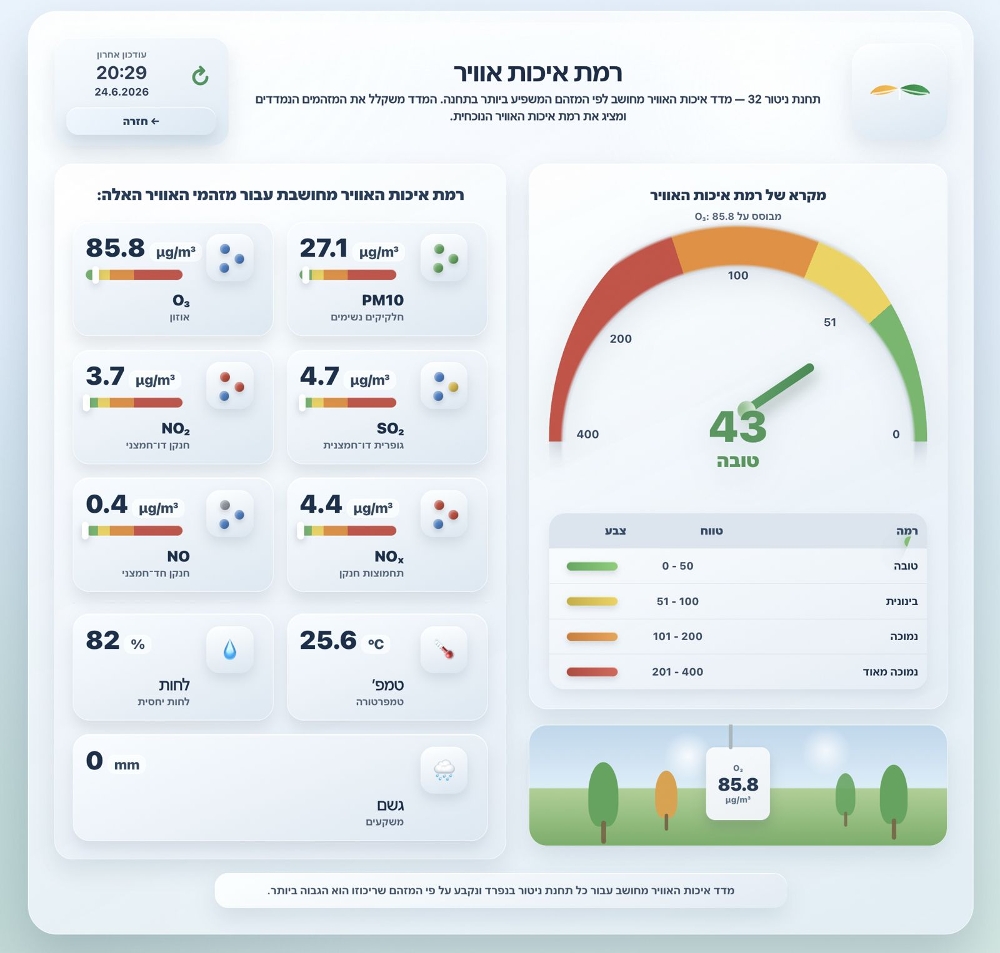

# Air Sviva Dashboard Card

[](https://github.com/moshiko2312/Air-sviva-dashboard-card/releases)

Custom Home Assistant Lovelace card for displaying Air Sviva station data in a rich dashboard layout.

- Latest Release: https://github.com/moshiko2312/Air-sviva-dashboard-card/releases/latest
- Changelog: [CHANGELOG.md](CHANGELOG.md)

## Preview



## Features

- Israel AQI gauge using pollutant breakpoints and dominant pollutant logic
- Pollutant metric cards (PM10, O3, SO2, NO2, NOX, NO)
- Weather cards (temperature, humidity, rain)
- Scene section with dynamic dominant pollutant display
- Navigation buttons (custom path + back button)
- Auto-detection of sensor prefix (`sensor.sviva_station_<id>_*`)
- RTL/Hebrew-friendly layout

## AQI Calculation

The card first looks for an official station AQI/index sensor from the integration. If one is found, that value is used for the main gauge. If no official AQI sensor is available, each supported pollutant is converted to a pollutant sub-index with pollutant-specific breakpoints, the highest sub-index is selected, and the displayed Israeli AQI is calculated as `100 - subIndex`.

## Installation

1. Copy `air-sviva-dashboard-card.js` to your Home Assistant `www` folder.
2. Add a Lovelace resource:
   - URL: `/local/air-sviva-dashboard-card.js`
   - Type: `module`
3. Reload the dashboard page.

## Basic Lovelace Config

```yaml
type: custom:air-sviva-dashboard-card
title: רמת איכות אוויר
station_name: תחנת ניטור 32
station_id: 32
show_weather: true
show_scene: true
show_legend: true
show_footer: true
```

## Main Configuration Options

- `title`: Card title
- `station_name`: Optional station display name
- `entity_prefix`: Manual entity prefix (example: `sensor.sviva_station_32`)
- `aqi_entity`: Optional explicit official AQI/index sensor
- `station_id`: Station ID for automatic prefix creation
- `max_width`: Max dashboard width (example: `2200px`)
- `full_height`: Full-height mode
- `show_scene`: Toggle scene strip
- `show_legend`: Toggle AQI legend
- `show_weather`: Toggle weather cards
- `show_footer`: Toggle footer note
- `show_back_button`: Toggle back button
- `back_button_label`: Back button text
- `back_button_path`: Optional explicit back path
- `nav_button_label`: Extra navigation button text
- `nav_button_path`: Extra navigation button path

## Sensor Naming

Expected pattern:

- `sensor.sviva_station_<id>_pm10`
- `sensor.sviva_station_<id>_o3`
- `sensor.sviva_station_<id>_so2`
- `sensor.sviva_station_<id>_no2`
- `sensor.sviva_station_<id>_nox`
- `sensor.sviva_station_<id>_no`
- `sensor.sviva_station_<id>_temp`
- `sensor.sviva_station_<id>_rh`
- `sensor.sviva_station_<id>_rain`

## Notes

- If entities are missing, the card shows a clear error message.
- If Home Assistant caches an old file, add a query string to resource URL, for example:
  - `/local/air-sviva-dashboard-card.js?v=2026-06-24`
